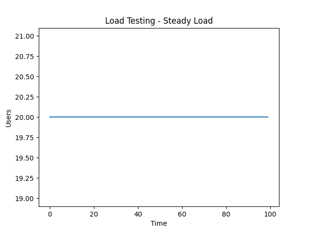
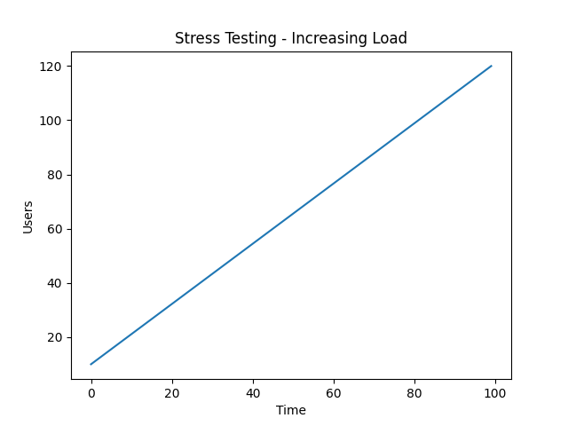
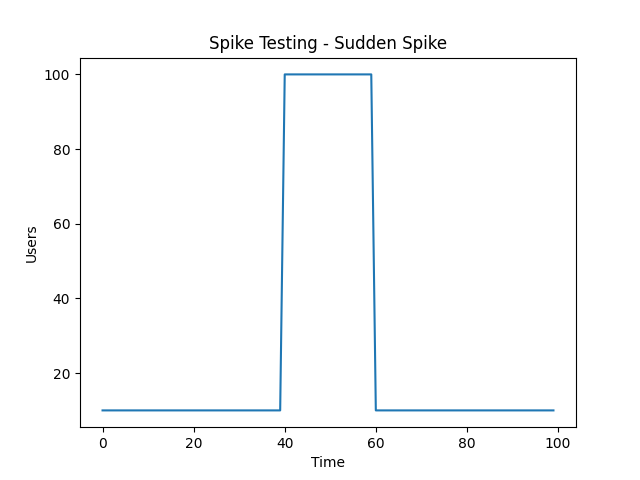
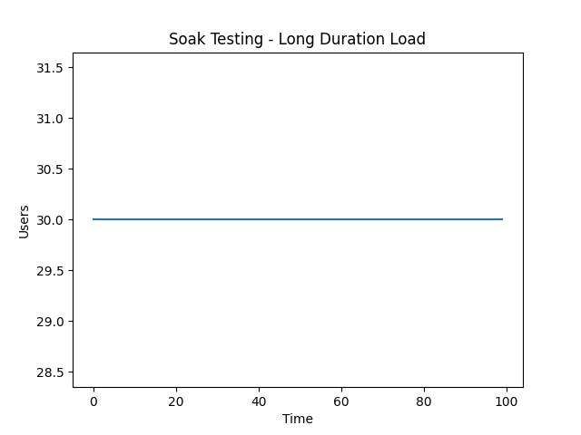

# Performance Testing Guide

Este documento describe los principales tipos de **Performance Testing** implementados en este proyecto utilizando Playwright.
Estos cuatro tipos de pruebas permiten validar diferentes aspectos del rendimiento del sistema:

* **Load Testing** → comportamiento esperado
* **Stress Testing** → límites del sistema
* **Spike Testing** → resiliencia ante picos
* **Soak Testing** → estabilidad en el tiempo

Implementarlos en conjunto proporciona una visión completa del rendimiento y la escalabili
---

## ✅ 1. Load Testing (Pruebas de Carga)

### 🧠 ¿Qué es?

El **Load Testing** evalúa cómo se comporta el sistema bajo una carga esperada de usuarios concurrentes.

### 🎯 Objetivo

* Validar que el sistema funciona correctamente bajo condiciones normales
* Medir tiempos de respuesta
* Detectar degradación leve

### 📌 Características

* Número de usuarios moderado
* Requests concurrentes
* Se espera **100% de éxito**

### 💡 Ejemplo

Simular 20 usuarios haciendo requests al mismo tiempo a un endpoint.

## Load Testing

---

## 🔥 2. Stress Testing (Pruebas de Estrés)

### 🧠 ¿Qué es?

El **Stress Testing** lleva el sistema al límite para encontrar su punto de quiebre.

### 🎯 Objetivo

* Determinar la capacidad máxima del sistema
* Identificar cuándo comienzan los fallos
* Evaluar cómo se degrada el sistema

### 📌 Características

* Alta concurrencia (muchos usuarios)
* Se permiten fallos
* Se mide el comportamiento bajo presión

### 💡 Ejemplo

Simular 100+ usuarios concurrentes y medir cuántas requests fallan.

## Stress Testing

---

## ⚡ 3. Spike Testing (Pruebas de Pico)

### 🧠 ¿Qué es?

El **Spike Testing** evalúa cómo responde el sistema ante aumentos repentinos de carga.

### 🎯 Objetivo

* Validar resiliencia ante picos inesperados
* Medir recuperación del sistema

### 📌 Características

* Cambio brusco de carga (ej: de 5 a 100 usuarios)
* Se combinan fases: normal → pico
* Se permiten fallos durante el spike

### 💡 Ejemplo

Pasar de 5 usuarios normales a 50+ de golpe.

## Spike Testing

---

## ⏳ 4. Soak Testing (Pruebas de Resistencia)

### 🧠 ¿Qué es?

El **Soak Testing** evalúa el comportamiento del sistema durante un periodo prolongado bajo carga constante.

### 🎯 Objetivo

* Detectar memory leaks
* Identificar degradación progresiva
* Evaluar estabilidad a largo plazo

### 📌 Características

* Duración prolongada (minutos u horas)
* Carga constante
* Análisis por iteraciones

### 💡 Ejemplo

Ejecutar requests cada cierto intervalo durante 30 minutos.

## Soak Testing

---

## 📊 Resumen Comparativo

| Tipo   | Enfoque                  | Carga     | Fallos Esperados |
| ------ | ------------------------ | --------- | ---------------- |
| Load   | Uso normal               | Moderada  | ❌ No             |
| Stress | Límite del sistema       | Alta      | ✅ Sí             |
| Spike  | Cambios bruscos          | Variable  | ✅ Sí             |
| Soak   | Resistencia en el tiempo | Constante | ⚠️ Posibles      |

---
